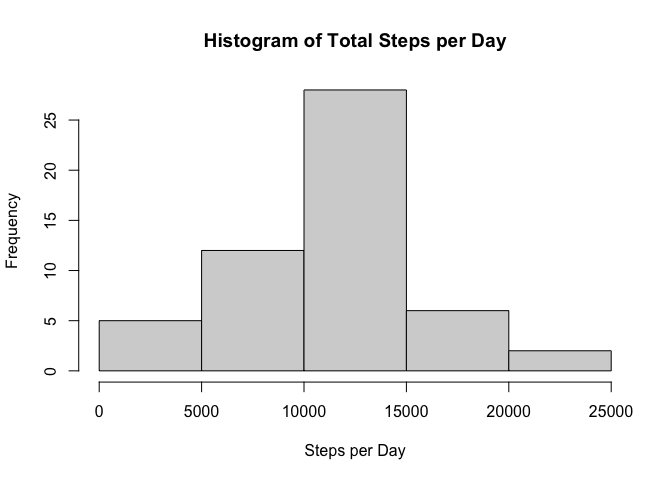
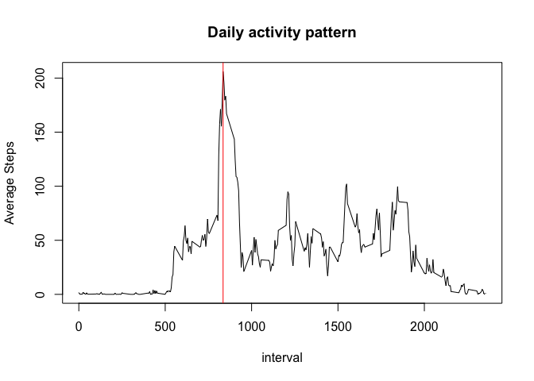
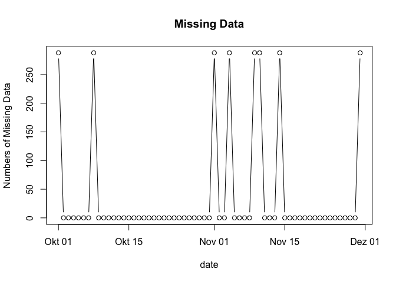
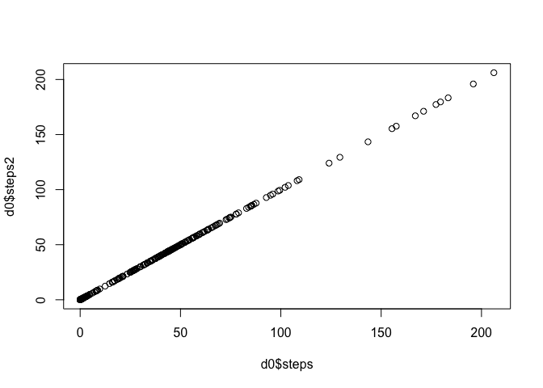
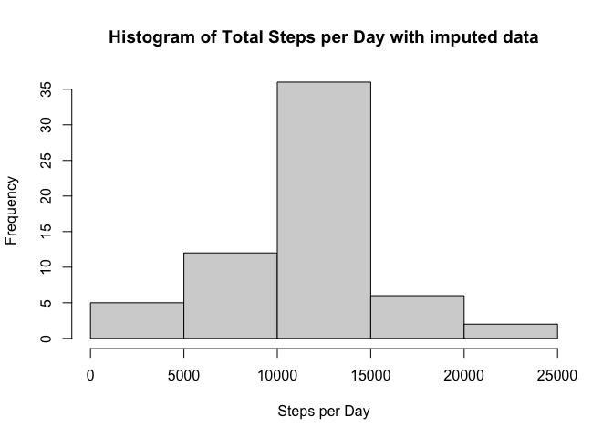
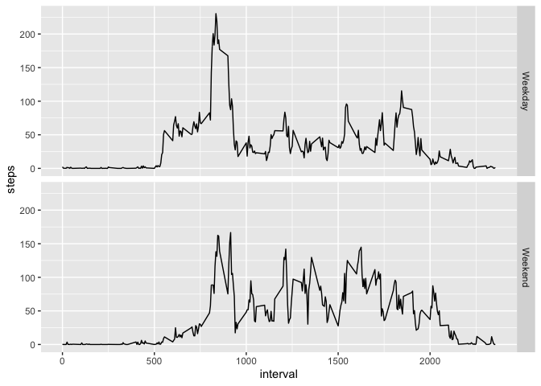

## Loading and preprocessing the data


```r
# Load tidyverse
library(tidyverse)
```


```r
localfile <- "activity.csv"
if (!file.exists(localfile)) {
  unzip ("activity.zip")
}

data <- read.csv(localfile)
data$date <- as.Date(data$date, "%Y-%m-%d")
summary(data)
```

```
##      steps             date               interval     
##  Min.   :  0.00   Min.   :2012-10-01   Min.   :   0.0  
##  1st Qu.:  0.00   1st Qu.:2012-10-16   1st Qu.: 588.8  
##  Median :  0.00   Median :2012-10-31   Median :1177.5  
##  Mean   : 37.38   Mean   :2012-10-31   Mean   :1177.5  
##  3rd Qu.: 12.00   3rd Qu.:2012-11-15   3rd Qu.:1766.2  
##  Max.   :806.00   Max.   :2012-11-30   Max.   :2355.0  
##  NA's   :2304
```

## What is mean total number of steps taken per day?


```r
data %>% 
  filter (!is.na(steps)) %>% 
  group_by(date) %>% 
  summarise_all(sum) %>% 
  select(steps) %>% 
  unlist() %>% hist( main="Histogram of Total Steps per Day",
                     xlab="Steps per Day")
```


Mean and Median of the total number of steps taken per day:

```r
data %>% 
  filter (!is.na(steps)) %>% 
  group_by(date) %>% 
  summarise_all(sum) %>% 
  select(steps) %>% summarise(mean(steps),median(steps))
```

```
## # A tibble: 1 x 2
##   `mean(steps)` `median(steps)`
##           <dbl>           <int>
## 1        10766.           10765
```


## What is the average daily activity pattern?


```r
b0 <- data %>% 
    select (interval, steps) %>%
    filter (!is.na(steps)) %>% 
    group_by(interval) %>% 
    summarise_all(mean) 

b0 %>%
    plot(type="l", main="Daily activity pattern",
           ylab="Average Steps")
    abline(v = b0$interval[b0$steps == max(b0$steps)], col="red")
```


Maximum numbers of steps is 835


## Imputing missingdata


```r
# Summary of Data
summary(data)
```

```
##      steps             date               interval     
##  Min.   :  0.00   Min.   :2012-10-01   Min.   :   0.0  
##  1st Qu.:  0.00   1st Qu.:2012-10-16   1st Qu.: 588.8  
##  Median :  0.00   Median :2012-10-31   Median :1177.5  
##  Mean   : 37.38   Mean   :2012-10-31   Mean   :1177.5  
##  3rd Qu.: 12.00   3rd Qu.:2012-11-15   3rd Qu.:1766.2  
##  Max.   :806.00   Max.   :2012-11-30   Max.   :2355.0  
##  NA's   :2304
```

2304 steps data are missing


```r
c0 <- data %>% 
    select (interval, date, steps) %>%
      mutate (observations = 1, missing = is.na(steps)) %>%
      group_by(date) %>%
      summarise_all(sum)

  

c0 %>% select (date, missing) %>%
    plot(type="b", main="Missing Data",
           ylab="Numbers of Missing Data")
```


Imputing Strategy: rounded mean of steps per interval

```r
# mean of steps per interval is already calculated and stored as b0
# for imputing missing data, rounded mean of steps per interval is used as numbers of steps are defined as integer

data_imputed <- data %>%
    rowwise() %>%
    mutate (steps2 = ifelse(is.na(steps), round(b0$steps[b0$interval==interval],0),steps), .after=steps) %>%
    mutate (delta_steps = steps - steps2, .after=steps2)

# check
d0 <- data_imputed %>% 
    select (interval, steps, steps2) %>%
    group_by(interval) %>% 
    summarise_all(mean, na.rm = TRUE)
plot(d0$steps,d0$steps2)
```



```r
#generating new data set
data_new <- data_imputed %>%
            select (steps = steps2, date, interval)
```
 

```r
data_new %>% 
 select (date,steps) %>%
  group_by(date) %>% 
  summarise_all(sum) %>% 
  select(steps) %>% 
  unlist() %>% hist( main="Histogram of Total Steps per Day with imputed data",
                     xlab="Steps per Day")
```




## Are there differences in activity patterns between weekdays and weekends?

```r
## new factor "daytype"
data_new <- data_new %>%
  mutate (weekday = weekdays(date)) %>%
  mutate (daytype= ifelse (as.POSIXlt(date)$wday %in% 1:5, "Weekday", "Weekend"))
data_new$daytype = as.factor(data_new$daytype)


data_new %>%
    select (interval, steps, daytype) %>%
    group_by(interval,daytype) %>% 
    summarise_all(mean) %>%
  
  ggplot() +
  aes (x=interval, y=steps, group=daytype) +
  geom_line() +
  facet_grid(daytype~ .)
```

<!-- -->


